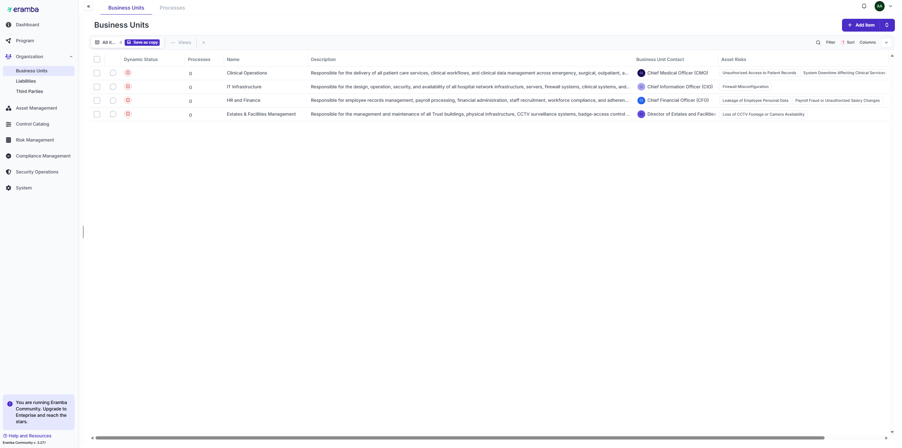
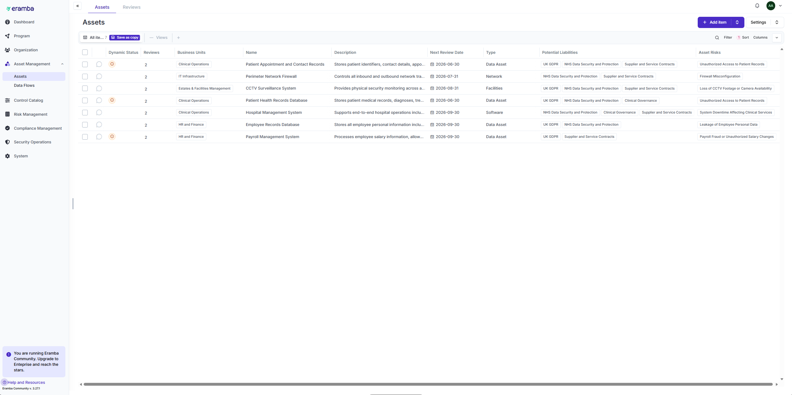
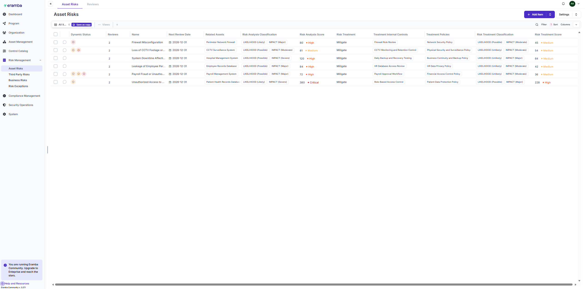
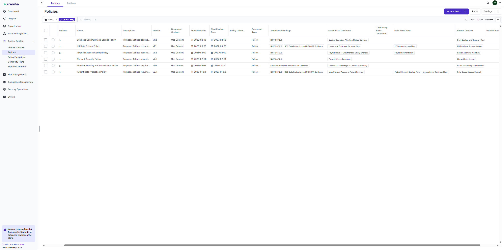
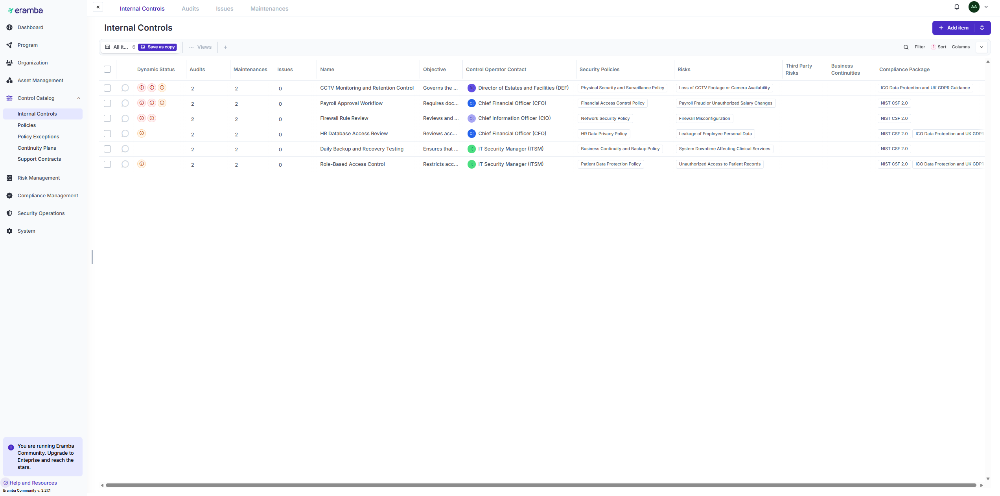
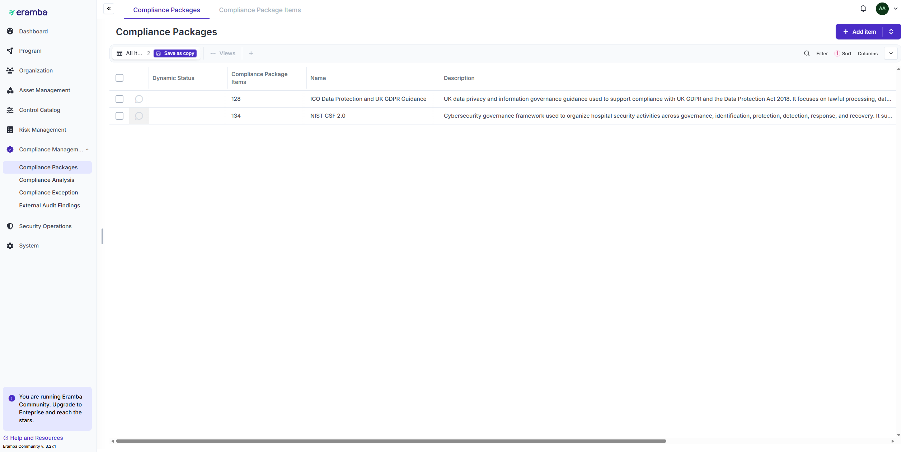
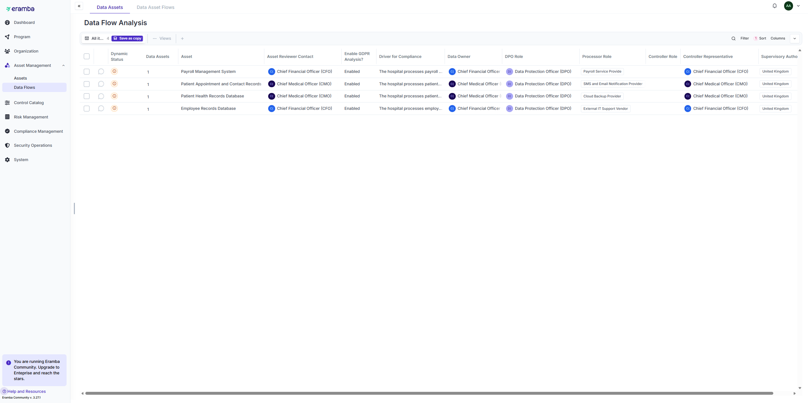
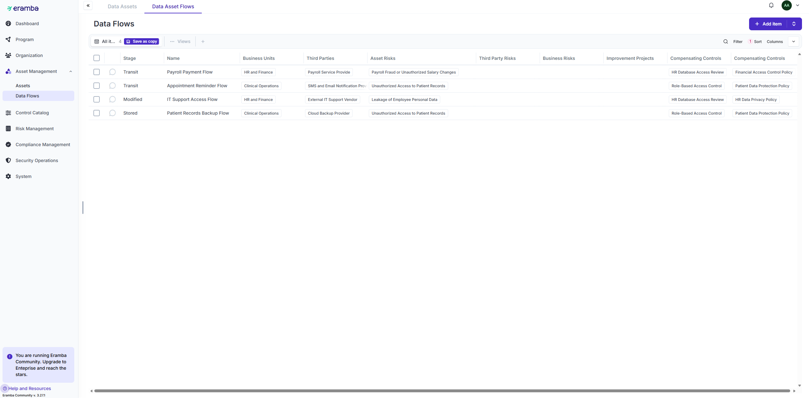
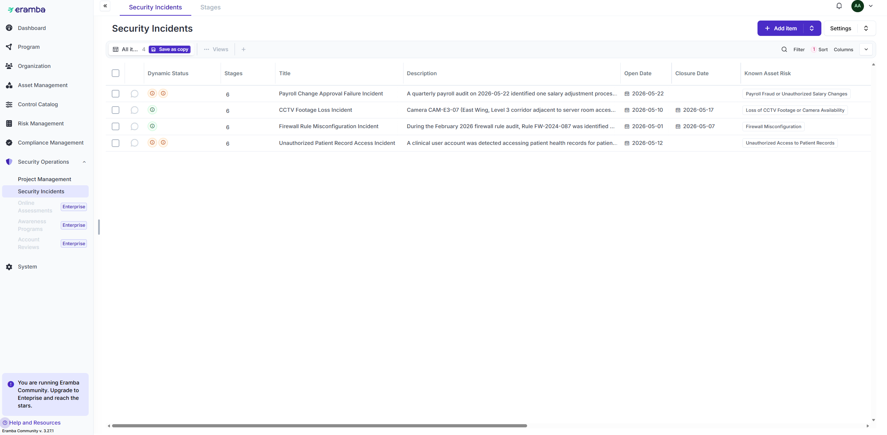
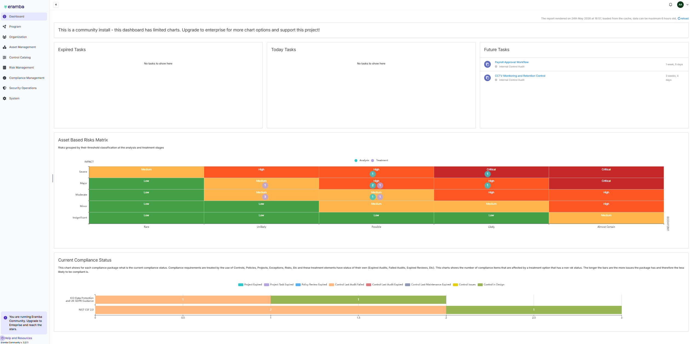

# 🛡️ Healthcare GRC System — Design & Implementation with Eramba

**Real-Time Governance, Risk & Compliance (GRC) implementation for a healthcare organization, built on Eramba and mapped to NIST CSF 2.0 and UK GDPR.**


---

## 📋 Overview

This project demonstrates the end-to-end design and implementation of a Governance, Risk, and Compliance (GRC) program using **Eramba**, built for a fictional healthcare organization, **St Thomas' Hospital**.

The goal was to build a working GRC environment that gives an organization centralized visibility into its assets, risks, controls, compliance posture, privacy obligations, and security incidents — the same core capabilities a real hospital's security/compliance team would rely on day to day.

The implementation is aligned to two widely used frameworks:
- **NIST Cybersecurity Framework (CSF) 2.0** — for security governance and controls
- **UK GDPR** — for data protection and privacy compliance

**Why this matters:** Healthcare organizations sit at the intersection of highly sensitive data (patient records), strict regulation (GDPR, and in other jurisdictions HIPAA), and high-value attack surfaces (medical devices, legacy systems, third-party vendors). This project simulates the GRC tooling and processes that let a security team manage that risk systematically rather than reactively.

---

## 🏥 Organization Profile

| Item | Description |
|---|---|
| **Organization** | St Thomas' Hospital |
| **Industry** | Healthcare |
| **Frameworks** | NIST CSF 2.0, UK GDPR |
| **Platform** | Eramba 3.27.3 |
| **Focus Areas** | Risk, Compliance, Privacy, Incident Management |

---

## 🧰 Technologies & Concepts Used

| Category | Details |
|---|---|
| **GRC Platform** | Eramba |
| **Compliance Frameworks** | NIST CSF 2.0, UK GDPR, ICO Data Protection Guidance |
| **Risk Management** | Asset-based risk assessment, risk appetite matrix, risk treatment planning |
| **Privacy Management** | Data assets, processing activities, third-party register, data flow mapping |
| **Incident Management** | Incident tracking, lifecycle management, lessons-learned process |

---

## 🏗️ GRC Architecture

```
                St Thomas' Hospital
                        │
                        ▼
                 Business Units
                        │
                        ▼
                     Assets
                        │
                        ▼
                     Risks
                        │
                        ▼
         Policies & Internal Controls
                        │
                        ▼
    Compliance Frameworks (NIST CSF 2.0 / GDPR)
                        │
                        ▼
              Privacy Management
                        │
                        ▼
             Incident Management
                        │
                        ▼
             Dashboard & Reporting
```

Each layer feeds the one above it: assets are tied to business units, risks are tied to assets, controls mitigate risks, and compliance/privacy/incident modules all roll up into a single reporting dashboard.

---

## 📌 Implementation Walkthrough

### 1. Organization Setup

**Business Units** — Three business units were defined to structure ownership and accountability:
- Clinical Operations
- Information Technology
- HR & Finance

**Assets** — Five organizational assets were identified and classified by criticality:
- Patient Health Records Database
- Payroll Management System
- CCTV Monitoring System
- Hospital Network Infrastructure
- Patient Appointment System




---

### 2. Risk Management

Five cybersecurity risks were identified and linked directly to the assets above, then scored and prioritized using the organization's risk methodology (likelihood × impact).

| Risk | Linked Asset |
|---|---|
| Unauthorized Patient Record Access | Patient Health Records Database |
| Firewall Misconfiguration | Hospital Network Infrastructure |
| Payroll Fraud | Payroll Management System |
| CCTV Monitoring Failure | CCTV Monitoring System |
| Ransomware Attack | Hospital Network Infrastructure |

High-priority risks received treatment plans, including stronger access controls, formalized firewall change management, backup verification procedures, and expanded monitoring coverage.



---

### 3. Policy Management

Four core policies were implemented to formalize security and operational expectations:
- Information Security Policy
- Access Control Policy
- Backup & Recovery Policy
- Incident Response Policy



---

### 4. Internal Controls

Controls were mapped to risks to demonstrate measurable mitigation:
- Role-Based Access Control
- Firewall Reviews
- Backup Verification
- CCTV Monitoring Reviews



---

### 5. Compliance Analysis

Controls and policies were mapped against NIST CSF 2.0 and UK GDPR requirements to identify gaps and demonstrate coverage.



---

### 6. Data Privacy Management

**Privacy-sensitive assets** were catalogued separately from general IT assets to support GDPR Article 30 record-keeping:
- Patient Health Records
- Appointment Records
- Employee Records

**Third parties** with access to personal data were documented and risk-assessed:
- Payroll Provider
- Cloud Backup Provider
- SMS Notification Service

**Data flows** were mapped to trace how personal data moves between internal systems and external processors.





---

### 7. Incident Management

Security incidents were logged and tracked through a defined lifecycle (detection → response → resolution → lessons learned):
- Unauthorized Patient Record Access
- Firewall Misconfiguration
- Payroll Approval Failure
- CCTV Footage Loss



---

### 8. Dashboard & Reporting

A centralized dashboard consolidates risk exposure, compliance status, treatment progress, and overall security posture for leadership reporting.



---

## ✅ Key Results

| Capability | Status |
|---|:---:|
| Business Units | ✅ |
| Asset Management | ✅ |
| Risk Register | ✅ |
| Risk Treatment Plans | ✅ |
| Policy Management | ✅ |
| Internal Controls | ✅ |
| NIST CSF 2.0 Compliance | ✅ |
| UK GDPR Compliance | ✅ |
| Privacy Management | ✅ |
| Third-Party Management | ✅ |
| Incident Management | ✅ |
| Dashboard Reporting | ✅ |

---

## 🎯 Skills Demonstrated

- **Governance** — GRC framework design, risk governance, compliance program management
- **Risk Management** — asset-based risk assessment, risk analysis, treatment planning
- **Compliance** — NIST CSF 2.0 mapping, UK GDPR compliance, gap analysis
- **Privacy** — data flow mapping, processing activity records, third-party risk management
- **Incident Response** — incident lifecycle management, root cause analysis, security reporting
- **Platform Administration** — Eramba configuration, dashboard/reporting setup

---

## 📂 Repository Structure

```
healthcare-grc-compliance-eramba/
│
├── README.md
├── LICENSE
│
└── images/
    ├── business-units.png
    ├── assets-list.png
    ├── risk-register.png
    ├── risk-treatment-plan.png
    ├── policies.png
    ├── internal-controls.png
    ├── nist-compliance.png
    ├── data-assets.png
    ├── third-parties.png
    ├── data-flows.png
    ├── incident-register.png
    └── dashboard-risk-matrix.png
```

---

## 🔭 Possible Next Steps

- Add ISO 27001 or HIPAA framework mapping alongside NIST/GDPR for broader coverage
- Automate risk scoring with a simple script/spreadsheet model
- Add a maturity assessment (e.g., against NIST CSF tiers) to show progression over time

---

## 📄 License

This project is shared under the [MIT License](LICENSE) — feel free to reference the structure and approach for your own GRC learning projects.

## 👤 Author

**0xcgz** — [github.com/0xcgz](https://github.com/0xcgz)
